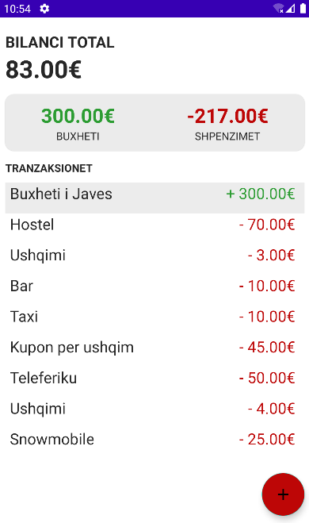

# KURSEHU
---
### Aplikacion per platformen Android qe sherben per shenim te harxhimeve te perditshme
---
## Teknologjia e perdorur:

* Kotlin
* Xml
* SQL-lite
---
## Specifikat

* Ju mund të vendosni buxhete
* Ju mund të gjurmoni shpenzimet tuaja
* Mund të shtoni dhe përditësoni transaksione
* Të hiqni dhe të zhbëni veprimin e saporealizuar
* Të i ruani transaksionet në kujtesën e telefonit tuaj
---
## Pamje dhe pershkrime

Pas hapjes se aplikacionit do te shfaqet faqja e transaksioneve ne te cilen mund te shohim shumen e parave qe kemi, shumen e harxhimeve si dhe bilancin aktual. Prej ketij ekrani mund te shtoni transaksione te reja duke e shtypur butonin "Shto tranzaksione", pas se ciles hapet faqja per shtimin e transaksioneve. Po ashtu nga kjo faqe mund te ndryshojme nje transaksion duke shtypur mbi transaksionin qe deshirojme dhe duke i ndryshuar informatat e saja. Se fundmi nese nje transaksion nuk na duhet atehere munt ta rreshqasim ate ne te djathte (swipe right) me c'rast fshihet transaksioni.


Kjo eshte faqja e transaksioneve            |  Ketu shtojme nje transaksion| Ketu ndryshojme nje transaksion ekzistues
:-------------------------:|:-------------------------:|:-------------------------:
  |   | 

---
## Kode me rendesi
* Kodi per punim me database, fshirje me swipe gesture, shtim/largim nga databaza duke thirur databazen: 
```
override fun onCreate(savedInstanceState: Bundle?) {
        super.onCreate(savedInstanceState)
        setContentView(R.layout.activity_main)

        transactions = arrayListOf()

        transactionAdapter = TransactionAdapter(transactions)
        linearLayoutManager = LinearLayoutManager(this)

        db = Room.databaseBuilder(
            this,
            AppDatabase::class.java,
            "transactions").build()

        recyclerview.apply {
            adapter = transactionAdapter
            layoutManager = linearLayoutManager
        }
        //swipe to remove
        val itemTouchHelper = object: ItemTouchHelper.SimpleCallback(0, ItemTouchHelper.RIGHT){
            override fun onMove(
                recyclerView: RecyclerView,
                viewHolder: RecyclerView.ViewHolder,
                target: RecyclerView.ViewHolder
            ): Boolean {
               return false
            }

            override fun onSwiped(viewHolder: RecyclerView.ViewHolder, direction: Int) {
                deleteTransaction(transactions[viewHolder.adapterPosition])
            }

        }

        val swipeHelper = ItemTouchHelper(itemTouchHelper)
        swipeHelper.attachToRecyclerView(recyclerview)

        addBtn.setOnClickListener {
            val intent = Intent(this, AddTransactionActivity::class.java)
            startActivity(intent)
        }
    }

    private fun fetchAll() {
        // background thread to call db methods
        GlobalScope.launch {
            transactions = db.transactionDao().getAll()

            runOnUiThread {
                updateDashBoard()
                transactionAdapter.setData(transactions)
            }
        }
    }

    private fun updateDashBoard() {
        val totalAmount = transactions.map { it.amount }.sum()
        val budgetAmount = transactions.filter { it.amount > 0 }.map { it.amount }.sum()
        val expenseAmount = totalAmount - budgetAmount

        balance.text = "%.2f".format(totalAmount) + "€"
        budget.text = "%.2f".format(budgetAmount) + "€"
        expenses.text = "%.2f".format(expenseAmount) + "€"
    }

    private fun undoDelete(){
        GlobalScope.launch {
            db.transactionDao().insertAll(deletedTransaction)
            transactions = oldTransactions

            runOnUiThread {
                transactionAdapter.setData(transactions)
                updateDashBoard()
            }
        }
    }

    // show deteltion msg
    private fun showSnackBar() {
    val view = findViewById<View>(R.id.coordinator )
        val snackbar=  Snackbar.make(view, "Tranzaksioni u largua nga lista.", Snackbar.LENGTH_LONG)
        snackbar.setAction("C'beje"){
            undoDelete()
        }

            .setActionTextColor(ContextCompat.getColor(this, R.color.red))
            .setActionTextColor(ContextCompat.getColor(this, R.color.white))
            .show()
    }

    // undo
    private fun deleteTransaction(transaction: Transaction){
         deletedTransaction = transaction
        oldTransactions = transactions

        GlobalScope.launch {
            // delete transaction
            db.transactionDao().delete(transaction)

            // update transactio list
            transactions = transactions.filter {it.id != transaction.id }
            runOnUiThread {
                updateDashBoard()
                transactionAdapter.setData(transactions)
                showSnackBar()
            }
        }
    }
```
* Kodi per pune me detajet (shtim) e transaksionit:
```
 private lateinit var transaction: Transaction
    override fun onCreate(savedInstanceState: Bundle?) {
        super.onCreate(savedInstanceState)
        setContentView(R.layout.activity_detail)


        val transaction = intent.getSerializableExtra("transaction") as Transaction

        label_input.setText(transaction.label)
        amount_input.setText(transaction.amount.toString())
        description_input.setText(transaction.description)

        // reset focus
        rootView.setOnClickListener{
            this.window.decorView.clearFocus()

            val imm = getSystemService(Context.INPUT_METHOD_SERVICE) as InputMethodManager
            imm.hideSoftInputFromWindow(it.windowToken, 0)
        }

        label_input.addTextChangedListener {
            updateBtn.visibility = View.VISIBLE
            if(it!!.count() > 0)
                label_layout.error = null
        }

        amount_input.addTextChangedListener {
            updateBtn.visibility = View.VISIBLE
            if(it!!.count() > 0)
                amount_layout.error = null
        }

       description_input.addTextChangedListener {
            updateBtn.visibility = View.VISIBLE
        }

        updateBtn.setOnClickListener{
            val label = label_input.text.toString()
            val description = description_input.text.toString()
            val amount = amount_input.text.toString().toDoubleOrNull()

            if (label.isEmpty())
                label_layout.error = "Caktoni nje titull per tranzaksionin tuaj!"

            else if (amount== null)
                amount_layout.error = "Caktoni nje shume per tranzaksionin tuaj!"
            else {
                 val transaction= Transaction(transaction.id, label,amount, description)
                update(transaction)
            }
        }

        closeBtn.setOnClickListener {
            finish()
        }
    }

    private fun update(transaction: Transaction ){
        val db = Room.databaseBuilder(
            this,
            AppDatabase::class.java,
            "transactions").build()

        GlobalScope.launch {
            db.transactionDao().update(transaction)
            finish()
        }
    }

```
* Definimi i struktures se te dhenes Transaksion (per databaze):
```
data class Transaction(
    @PrimaryKey(autoGenerate = true)
    val id: Int,
    val label: String,
    val amount: Double,
    val description: String
)
```
* Kodi per ndryshim te transaksionit:
```
override fun onCreate(savedInstanceState: Bundle?) {
        super.onCreate(savedInstanceState)
        setContentView(R.layout.activity_add_transaction)

        label_input.addTextChangedListener {
            if(it!!.count() > 0)
                label_layout.error = null
        }

        amount_input.addTextChangedListener {
            if(it!!.count() > 0)
                amount_layout.error = null
        }

        addTransactionBtn.setOnClickListener{
            val label = label_input.text.toString()
            val description = description_input.text.toString()
            val amount = amount_input.text.toString().toDoubleOrNull()

           if (label.isEmpty())
               label_layout.error = "Caktoni nje titull per tranzaksionin tuaj!"

            else if (amount== null)
                amount_layout.error = "Caktoni nje shume per tranzaksionin tuaj!"
            else {
                val transaction= Transaction(0, label,amount, description)
               insert(transaction)
           }
        }

        closeBtn.setOnClickListener {
            finish()
        }
    }

    private fun insert(transaction: Transaction ){
       val db = Room.databaseBuilder(
            this,
            AppDatabase::class.java,
            "transactions").build()

        GlobalScope.launch {
            db.transactionDao().insertAll(transaction)
            finish()
        }
    }
```
---
[Back To The Top](#KURSEHU)
